# PrismQuant figures

These are the author's final presentation figures. The ten original PDFs were
copied byte for byte from the supplied `e13-pip/figures` directory. PNG previews
are rendered at 2000 pixels wide. SVG companions preserve the PDF marks and
outline text for reliable sharing; the original PDFs remain authoritative.
[Provenance and hashes](provenance.json).

| Figure | Content | Downloads |
| --- | --- | --- |
| Method | Construct, represent and deploy PrismQuant | [PDF](method.pdf) · [SVG](method.svg) · [PNG](method.png) |
| Figure 1 | Alignment mechanism and measured group traces | [PDF](fig1.pdf) · [SVG](fig1.svg) · [PNG](fig1.png) |
| Figure 2 | Layerwise energy, activation range and INT4 error | [PDF](fig2.pdf) · [SVG](fig2.svg) · [PNG](fig2.png) |
| Figure 3 | Geometry, energy coverage, range law and MoE evidence | [PDF](fig3.pdf) · [SVG](fig3.svg) · [PNG](fig3.png) |
| Figure 4 | Metadata budget, rank recovery and decoder-layer cost | [PDF](fig4.pdf) · [SVG](fig4.svg) · [PNG](fig4.png) |
| Figure 5 | Dedicated packed deployment implementation and benchmarks | [PDF](fig5.pdf) · [SVG](fig5.svg) · [PNG](fig5.png) |
| Figure 6 | Predicted versus measured quantization step | [PDF](fig6.pdf) · [SVG](fig6.svg) · [PNG](fig6.png) |
| Matrix Q | Author's Q activation comparison | [PDF](matrixq.pdf) · [SVG](matrixq.svg) · [PNG](matrixq.png) |
| Matrix P | Author's P activation comparison | [PDF](matrixp.pdf) · [SVG](matrixp.svg) · [PNG](matrixp.png) |
| Matrix D | Author's down-input activation comparison | [PDF](matrixd.pdf) · [SVG](matrixd.svg) · [PNG](matrixd.png) |
| Offset precision | Additional measured fp16 rounding diagnostic (E36) | [PDF](offset_precision.pdf) · [SVG](offset_precision.svg) · [PNG](offset_precision.png) · [Caption](offset_precision_caption.md) |

## Method

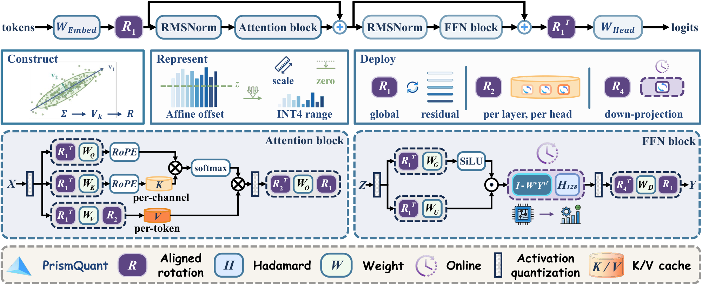

## Alignment

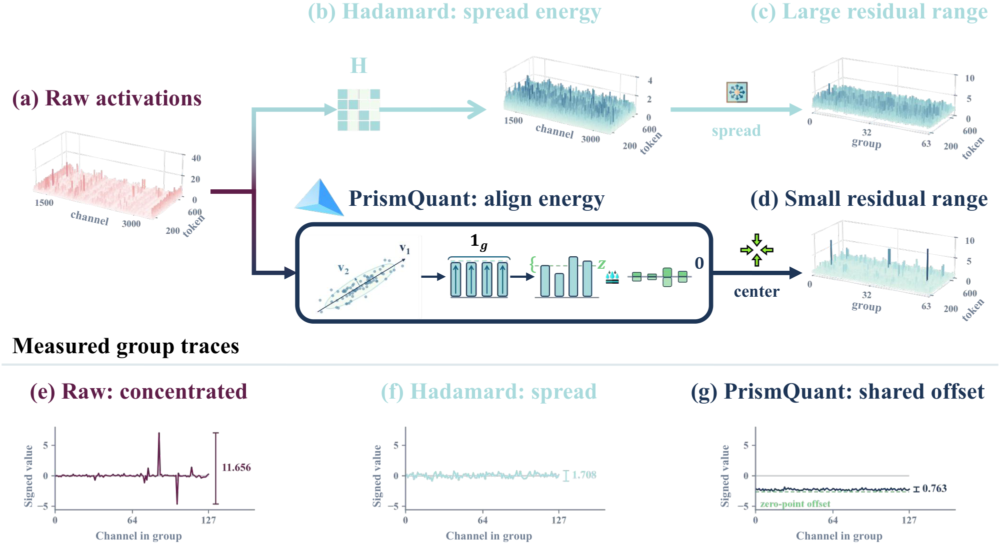

## Layerwise measurements

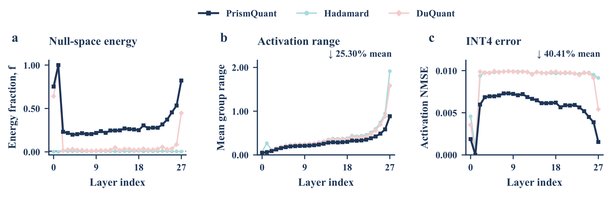

## Geometry and range law

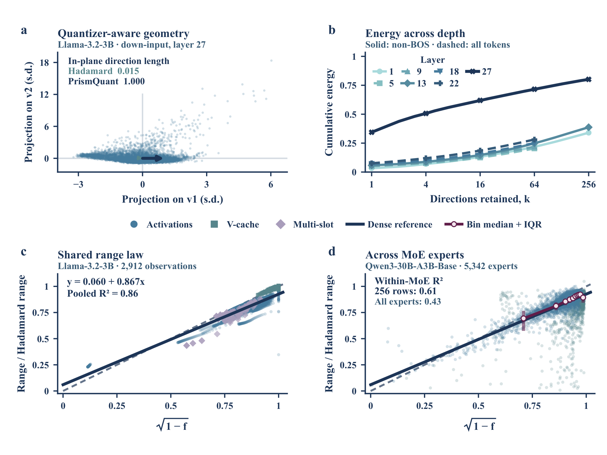

## Accuracy and rank

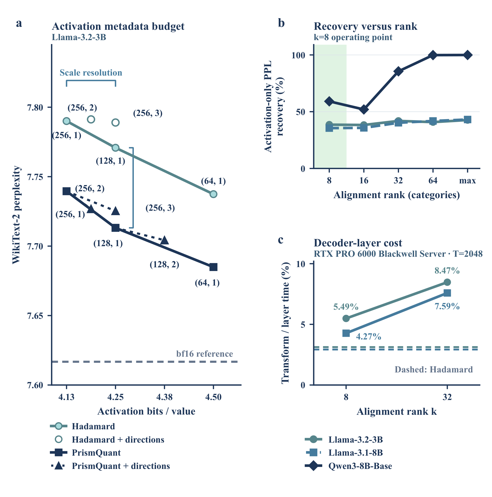

## Deployment

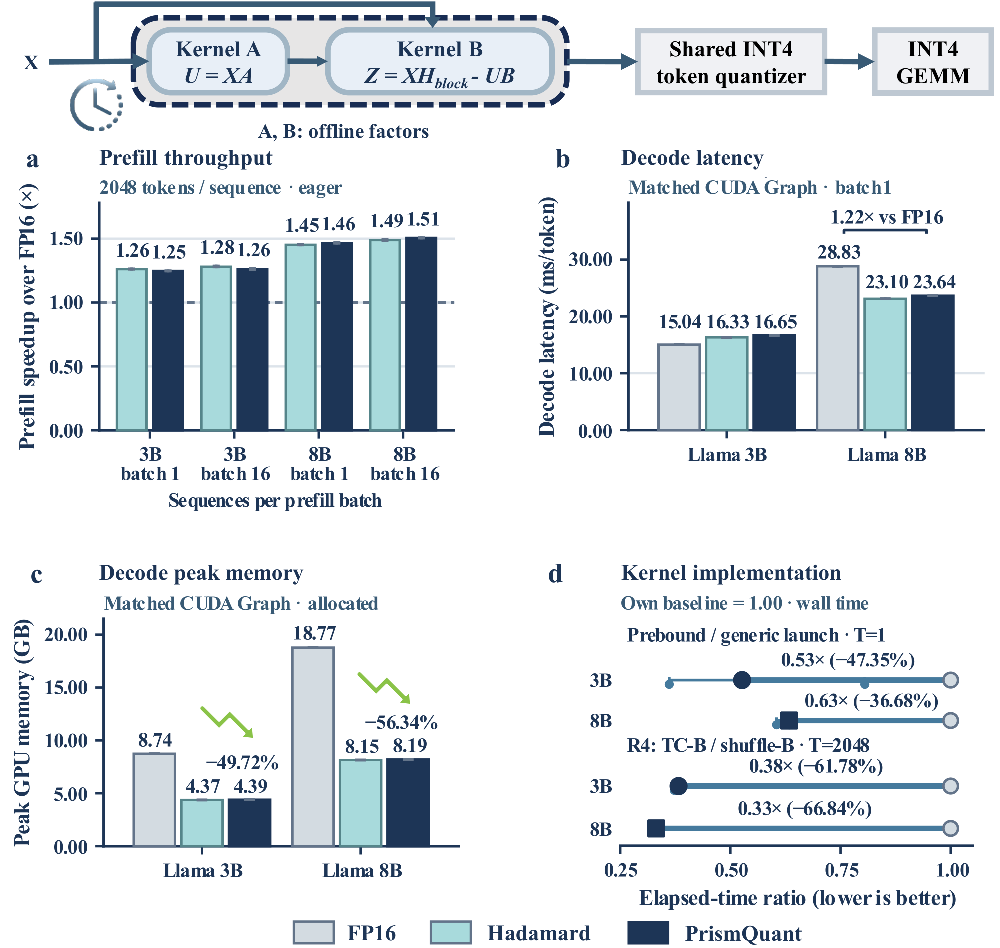

These throughput/memory results use the dedicated packed deployment path. They
do not describe the floating-point reference loader in the quick start.

## Quantization-step prediction

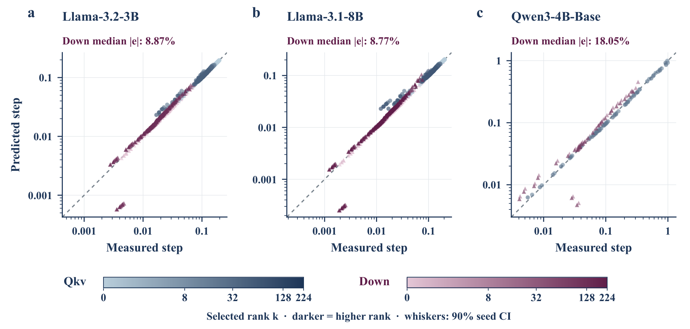

## Activation matrices

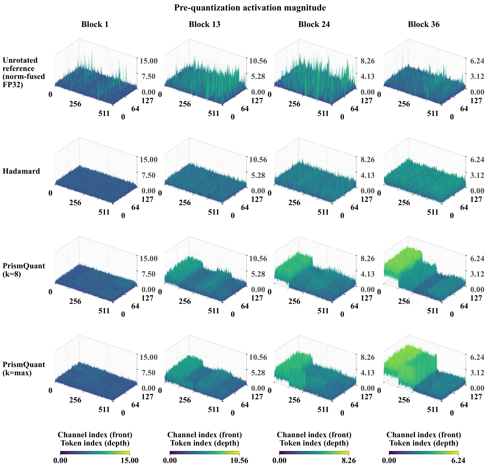

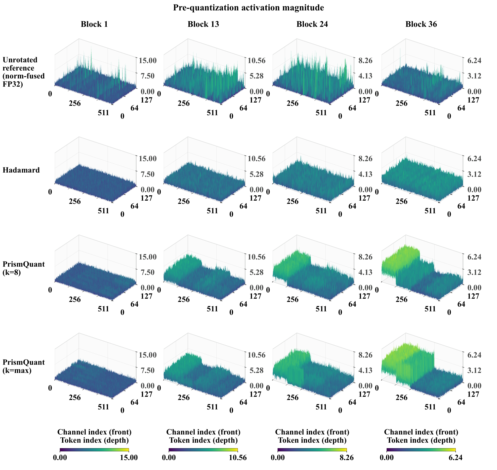

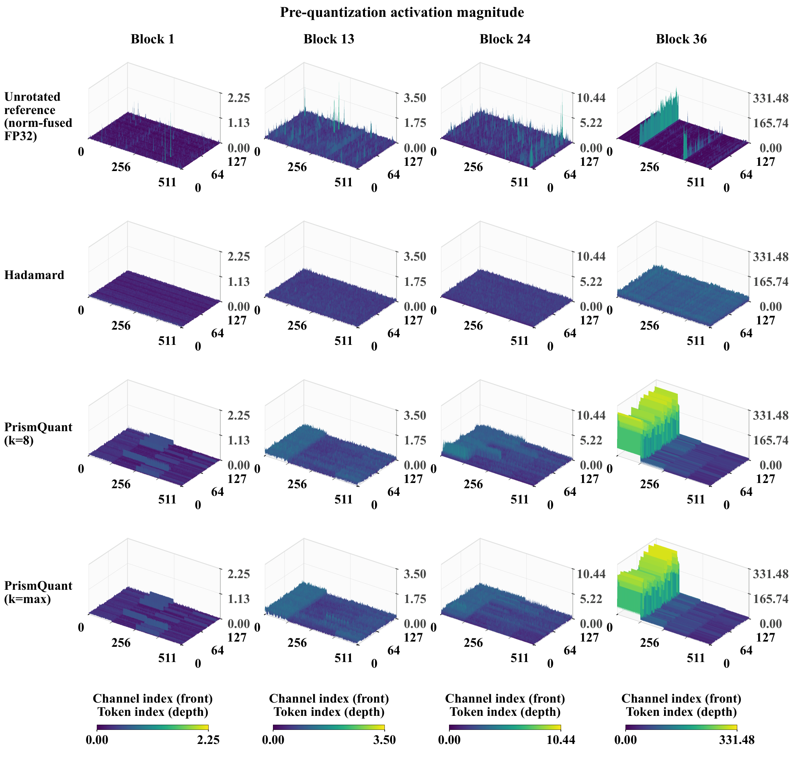

## Offset precision

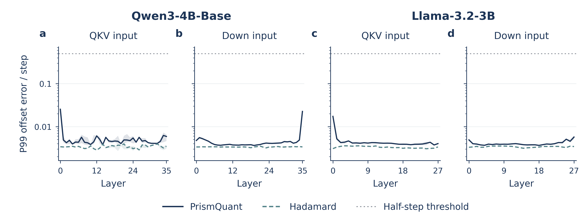

All scientific data, older editable figure sources and detailed benchmark
protocols remain in the
[research archive](https://github.com/ForeverBlue816/PrismQuant/tree/research-archive-2026-09-25).
